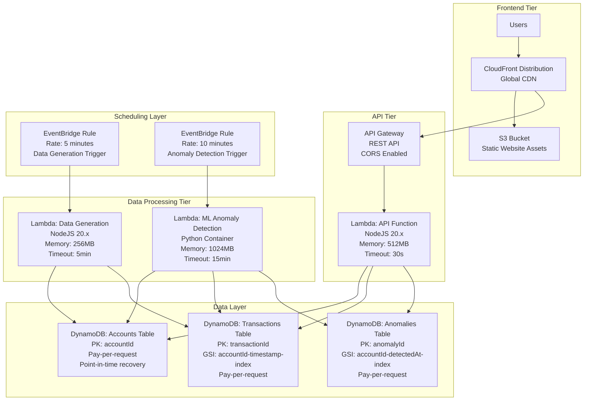

# Financial Anomaly Detection Platform

A real-time financial transaction dashboard with intelligent anomaly detection built on AWS serverless infrastructure.

## 🚀 Overview

Financial Anomaly Detection Platform is a 1-day MVP financial transaction dashboard that provides real-time visibility into company transactions across multiple accounts with ML-powered anomaly detection. The platform enables financial controllers and risk managers to monitor account activity, identify suspicious patterns, and proactively manage financial risk.

## ✨ Key Features

### 📊 Transaction Management
- View all transactions with filtering by account and date
- Create new transactions manually with real-time validation
- Immediate balance updates across all accounts
- Historical transaction analysis with configurable date ranges

### 🔍 Anomaly Detection
- **ML-Powered Analysis**: IsolationForest algorithm for detecting unusual patterns
- **Risk Categorization**: HIGH (>0.8), MEDIUM (0.5-0.8), LOW (<0.5) scoring
- **Visual Alerts**: Clear indicators for suspicious transactions
- **Trend Analysis**: Charts showing anomaly patterns over time
- **Account Health**: Risk assessment at the account level

### ⚡ Real-Time Processing
- **Automated Data Generation**: Realistic transactions every 5 minutes
- **Scheduled ML Analysis**: Anomaly detection every 10 minutes
- **Stale Account Pattern**: Efficient processing of only changed accounts
- **Event-Driven Architecture**: Real-time updates across the dashboard

## 🏗️ Architecture

### Infrastructure Overview



### Technology Stack

#### Frontend
- **Framework**: React 18 with TypeScript
- **Routing**: TanStack Router
- **Styling**: CSS Modules (Dropbox-style flat design)
- **Build Tool**: Vite with NX
- **Deployment**: S3 + CloudFront CDN

#### Backend
- **Runtime**: Node.js 20.x with TypeScript
- **Framework**: Express with serverless-http
- **Deployment**: AWS Lambda with CDK NodejsFunction
- **Validation**: Zod schemas for type safety

#### Machine Learning
- **Language**: Python 3.9+
- **ML Library**: scikit-learn IsolationForest
- **Runtime**: AWS Lambda Python container
- **Packaging**: UV for dependency management

#### Data Layer
- **Primary Database**: DynamoDB with pay-per-request billing
- **Query Patterns**: GSIs for account-based and time-series queries
- **Consistency**: Eventually consistent reads for dashboard performance

#### Infrastructure
- **Deployment**: AWS CDK (TypeScript)
- **Compute**: AWS Lambda functions
- **API**: API Gateway REST API
- **Scheduling**: EventBridge rules
- **Monitoring**: CloudWatch Logs + Metrics

## 🏃‍♂️ Quick Start

### Prerequisites
- Node.js 18+
- Python 3.9+
- AWS CLI configured
- AWS CDK CLI installed

### Installation

```bash
# Clone the repository
git clone <repository-url>
cd liveflow-application

# Install dependencies
npm install

# Build all packages
npx nx run-many --target=build --all
```

### Deployment

```bash
# Deploy infrastructure and application
npx nx run infrastructure:deploy

# The command will output URLs for:
# - CloudFront Distribution (Frontend)
# - API Gateway (Backend API)
```

### Development Commands

```bash
# Build specific package
npx nx build <package-name>

# Build all packages
npx nx run-many --target=build --all

# View infrastructure diff
npx nx run infrastructure:diff

# Destroy infrastructure
npx nx run infrastructure:destroy
```

## 📁 Project Structure

```
liveflow-application/
├── packages/
│   ├── api/                    # REST API Lambda function
│   ├── data-generation/        # Transaction data generator
│   ├── frontend/              # React dashboard
│   ├── infrastructure/        # AWS CDK deployment
│   ├── ml-anomaly/           # Python ML processing
│   └── shared/               # TypeScript types & schemas
├── memory-bank/              # Project documentation
├── .clinerules              # Project-specific patterns
└── README.md
```

### Package Overview

#### `packages/api/`
- Express REST API with serverless-http
- CRUD operations for accounts, transactions, anomalies
- Health check endpoint with dependency validation
- Zod schema validation for all requests/responses

#### `packages/frontend/`
- React SPA with TanStack Router
- Three main pages: transactions, anomalies, create transaction
- CSS Modules with Dropbox-style flat design
- Real-time data updates from API

#### `packages/ml-anomaly/`
- Python container with scikit-learn
- IsolationForest anomaly detection
- Stale account processing pattern
- Feature engineering for transaction analysis

#### `packages/data-generation/`
- Realistic transaction generator
- Configurable account targeting
- Balance calculation and validation
- Scheduled execution via EventBridge

#### `packages/infrastructure/`
- AWS CDK stack definition
- All AWS resources (Lambda, DynamoDB, API Gateway, etc.)
- Environment-based deployment
- Resource outputs and configuration

#### `packages/shared/`
- TypeScript interfaces and types
- Zod validation schemas
- Shared utilities and constants
- Cross-package type safety

## 🗄️ Database Schema

### Accounts Table
```typescript
{
  accountId: string (PK)
  accountName: string
  currentBalance: number
  accountType: string
  isStale: boolean
  lastUpdated: string
}
```

### Transactions Table
```typescript
{
  transactionId: string (PK)
  accountId: string
  amount: number
  description: string
  timestamp: string
  category: string
  runningBalance: number
}
// GSI: accountId-timestamp-index
```

### Anomalies Table
```typescript
{
  anomalyId: string (PK)
  accountId: string
  transactionId: string
  anomalyScore: number
  detectedAt: string
  anomalyType: string
  features: object
}
// GSI: accountId-detectedAt-index
```

## 📡 API Endpoints

### Health Check
```
GET /health
```

### Accounts
```
GET /accounts
GET /accounts/{accountId}
PUT /accounts/{accountId}
```

### Transactions
```
GET /transactions
POST /transactions
GET /transactions/{transactionId}
GET /transactions/by-account/{accountId}
```

### Anomalies
```
GET /anomalies
GET /anomalies/by-account/{accountId}
```

## 🔄 Automated Processing

### Data Generation (Every 5 minutes)
1. Select random subset of accounts
2. Generate realistic transactions with proper categorization
3. Update account balances and mark accounts as stale
4. Store transactions with computed features

### Anomaly Detection (Every 10 minutes)
1. Query stale accounts requiring ML processing
2. Extract transaction features for each account
3. Train/update IsolationForest model
4. Score recent transactions and identify anomalies
5. Store anomaly records and clear stale flags

## 🎨 Design Principles

- **Flat Design**: Dropbox-style interface with no borders or 3D effects
- **High Contrast**: Bold colors and clear typography for financial data
- **Data-First**: Information hierarchy prioritizes transaction data
- **Real-time Updates**: Always show current state, no stale data
- **Fail-Safe**: Clear error states, no silent failures

## 🚀 Deployment Architecture

### AWS Resources Created
- **3 DynamoDB Tables**: Accounts, Transactions, Anomalies
- **3 Lambda Functions**: API, Data Generation, ML Processing
- **1 API Gateway**: REST API with CORS support
- **2 EventBridge Rules**: Scheduled data generation and ML processing
- **1 S3 Bucket**: Static website hosting
- **1 CloudFront Distribution**: Global CDN with Origin Access Identity

### Environment Variables
All runtime configuration is handled via Lambda environment variables:
- Table names and ARNs
- AWS region
- Resource identifiers

### Security
- **IAM Roles**: Least privilege access for each Lambda function
- **API Gateway**: Built-in throttling and validation
- **CloudFront**: Origin Access Identity for S3 security
- **DynamoDB**: Encryption at rest enabled

## 📊 Monitoring & Observability

### CloudWatch Integration
- **Structured Logging**: All components use structured JSON logs
- **Custom Metrics**: Business KPIs and operational metrics
- **Log Retention**: 7-day retention for cost optimization

### Health Checks
- API health endpoint validates all dependencies
- DynamoDB table accessibility
- External service connectivity

### Alerting
- Lambda function errors
- API Gateway 4xx/5xx responses
- DynamoDB throttling

## 🔧 Development Practices

### Code Quality
- **TypeScript**: Strict type checking enabled
- **Zod Validation**: Runtime type validation for APIs
- **Error Handling**: Structured error responses, no silent failures
- **Testing**: AWS deployment testing with curl/AWS CLI

### Build System
- **NX Monorepo**: Efficient builds with dependency caching
- **Single Output**: All packages build to `dist/` directory
- **Dependency Management**: Shared types prevent version conflicts

### Deployment
- **Infrastructure as Code**: CDK for all AWS resources
- **Environment Isolation**: Support for dev/prod environments
- **Artifact Validation**: Build verification before deployment

## 📈 Performance Characteristics

### API Response Times
- Transaction queries: < 1 second
- Account balance retrieval: < 500ms
- Anomaly detection results: < 1 second

### Scalability
- **Transaction Volume**: Designed for thousands of transactions/day
- **Account Scale**: Optimized for dozens to hundreds of accounts
- **Concurrent Users**: API Gateway default limits (10,000 req/sec)

### Cost Optimization
- **Pay-per-request**: DynamoDB billing scales with usage
- **Lambda**: Only pay for execution time
- **CloudFront**: Global CDN with cost-effective caching

## 🛠️ Troubleshooting

### Common Issues

#### Build Failures
```bash
# Clean build artifacts
rm -rf dist/
npx nx run-many --target=build --all
```

#### Deployment Issues
```bash
# Check CDK diff
npx nx run infrastructure:diff

# View CloudFormation events
aws cloudformation describe-stack-events --stack-name LiveflowStack-dev
```

#### API Connectivity
```bash
# Test health endpoint
curl <API_GATEWAY_URL>/health

# Check CloudWatch logs
aws logs describe-log-groups --log-group-name-prefix "/aws/lambda"
```

### Operational Commands

```bash
# Check deployment status
aws cloudformation describe-stacks --stack-name LiveflowStack-dev

# Monitor Lambda logs
aws logs tail /aws/lambda/LiveflowStack-dev-ApiFunction --follow

# DynamoDB table scan
aws dynamodb scan --table-name <TABLE_NAME> --max-items 10
```

## 🤝 Contributing

This is a demonstration project showcasing modern serverless architecture and rapid development capabilities. The codebase follows production-ready patterns and can serve as a foundation for real financial monitoring applications.

### Key Design Decisions
- **No Local Development**: All testing against actual AWS resources
- **Fail Fast**: No fallbacks or mocking, clear error propagation
- **12-Factor App**: Configuration via environment variables
- **Event-Driven**: Loose coupling between components

## 📄 License

This project is a demonstration of technical capabilities and architectural patterns for financial technology applications.

---

**Built with ❤️ using AWS CDK, React, and Python • Deployed on AWS Serverless Infrastructure**